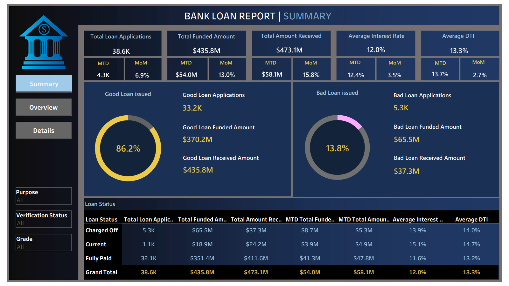
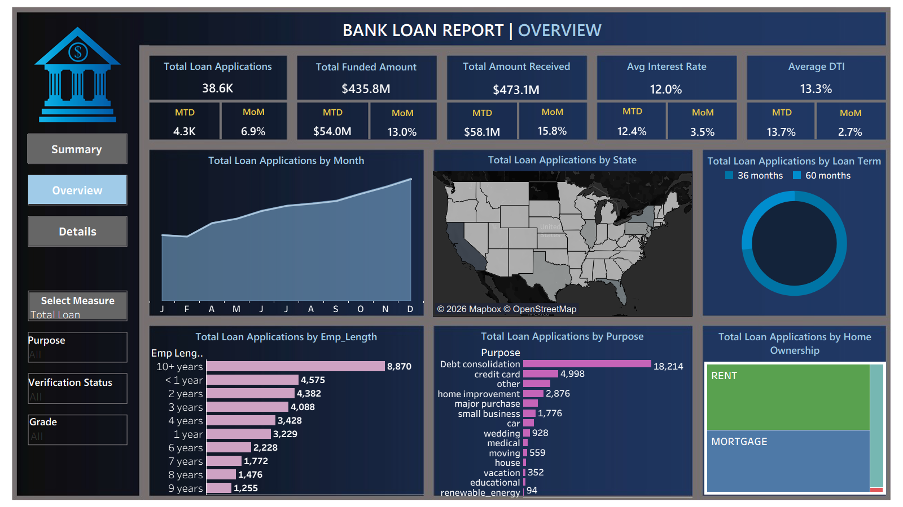
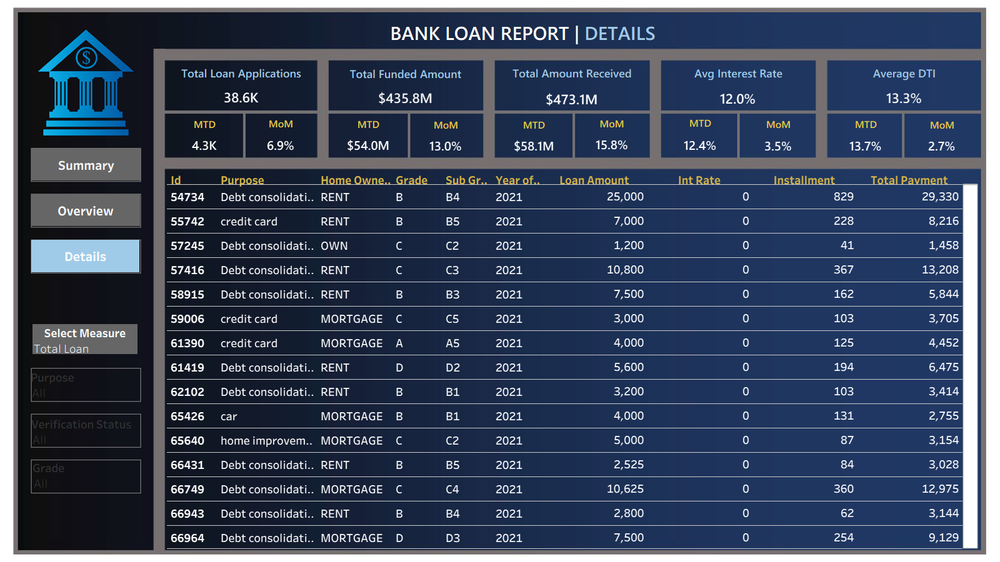

# Loan Performance & Credit Risk Analysis | Excel Dashboard & KPI Insights
## Project Overview:
This project analyzes loan performance and credit risk using a simulated real-world lending dataset to understand portfolio health, borrower behavior, and financial trends.
It focuses on evaluating key metrics such as loan applications, funded amount, received amount, interest rates, and debt-to-income (DTI) to assess overall portfolio performance.
The analysis was conducted using Excel, SQL, and Tableau for data exploration, cleaning, and visualization.
## Business Problem:
Banks need to balance loan growth with credit risk. While approving more loans increases revenue, it also raises the risk of defaults and financial losses.
The challenge is to understand loan performance, identify risky borrowers, and improve lending decisions to maintain a healthy and profitable loan portfolio.
## Data Overview:
**Records:** 38,600 | **Fields:** 20+ (loan & borrower attributes)

**Key variables:** Loan Amount, Interest Rate, Loan Status (paid/default), Issue Date, Term, Grade (risk), Annual Income
Records: 38,600
## Methodology:
* Data was cleaned and standardized using SQL and Excel, including date conversion and duplicate checks.
* Exploratory analysis was performed using SQL queries and Excel pivot tables to identify trends and relationships.
* Feature engineering was applied to create KPIs, time-based metrics (MTD, MoM), and loan risk classifications.
* Insights were visualized using Excel and Tableau dashboards.
## Key Calculations & Metrics:
* **Total Loan Applications:** Measures overall lending activity by counting unique loan records.
* **Total Funded Amount:** Represents total capital disbursed to borrowers across all approved loans.
* **Total Amount Received:** Captures total repayments received, reflecting cash flow performance.
* **Average Interest Rate:** Indicates the average cost of borrowing across the portfolio.
* **Average Debt-to-Income (DTI) Ratio:** Evaluates borrower financial stability and repayment capacity.
* **Month-to-Date (MTD) Metrics:** Tracks performance (applications, funding, repayments) within the selected month for real-time monitoring.
* **Month-over-Month (MoM) Growth:** Measures percentage change in key metrics compared to the previous month to assess performance trends.
## Dashboard:

[View Excel Dashboards](./excel_dashboards/)
## Skills:
* Data cleaning, validation & quality assessment (missing values, duplicates, formatting issues)
* Data transformation using conditional logic and date/time functions
* Pivot tables, charts & dashboard development for data analysis and visualization (including slicers)
* Feature engineering (categorical fields and time-based variables)
* KPI and financial metrics development
* SQL (joins, aggregations, filtering, CTEs, CASE statements for analysis)
## Key Insights & Recommendations:
* 86.2% good loans generated $65.3M revenue, while 13.8% bad loans caused $28.2M losses
* Portfolio is profitable (amount received > funded) with steady monthly growth
* Credit cards are the most common loan purpose; borrowers with 10+ years employment take the highest loans

**Recommendations:**

- Strengthen underwriting to reduce high-risk approvals
- Monitor repayment behavior for early default detection
- Improve collections and loan recovery processes
- Focus on low-risk borrowers to sustain profitability

